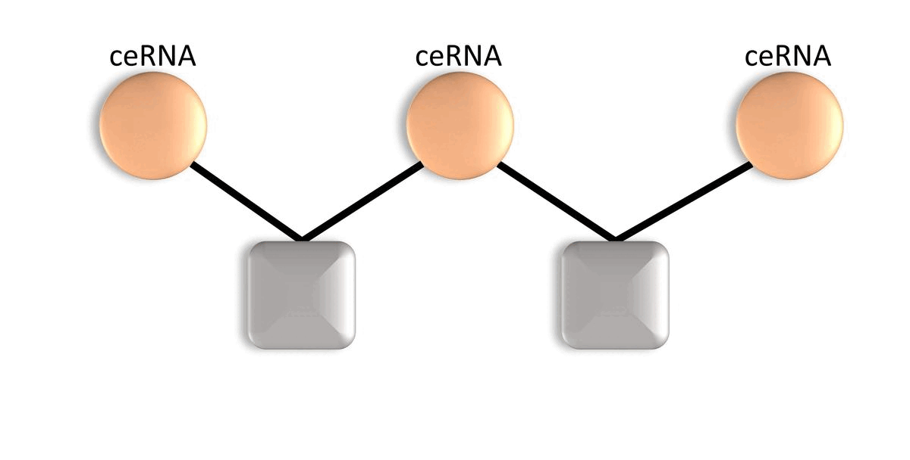

MicroRNAs (miRNAs) are a family of short non-coding RNAs that are key players of post-transciptional regulations. Targets of miRNAs compete against shared miRNAs, hypothesized as competing endogenous RNAs (ceRNAs).

We are working on developing network-based computational tools to bring a new perspective to complicated RNA interactions because of the complex interactions of a wide variety of RNA fragments in the cell. We developed novel tool, ceRNAnetsim package, which simulates regulations of ceRNA expression levels after a expression level change in one or more miRNA/mRNAs. The functions in the package which bases on the proportional distribution of miRNAs to targets, handle the given dataset as graph object and the processes progress via edge and node variables.
