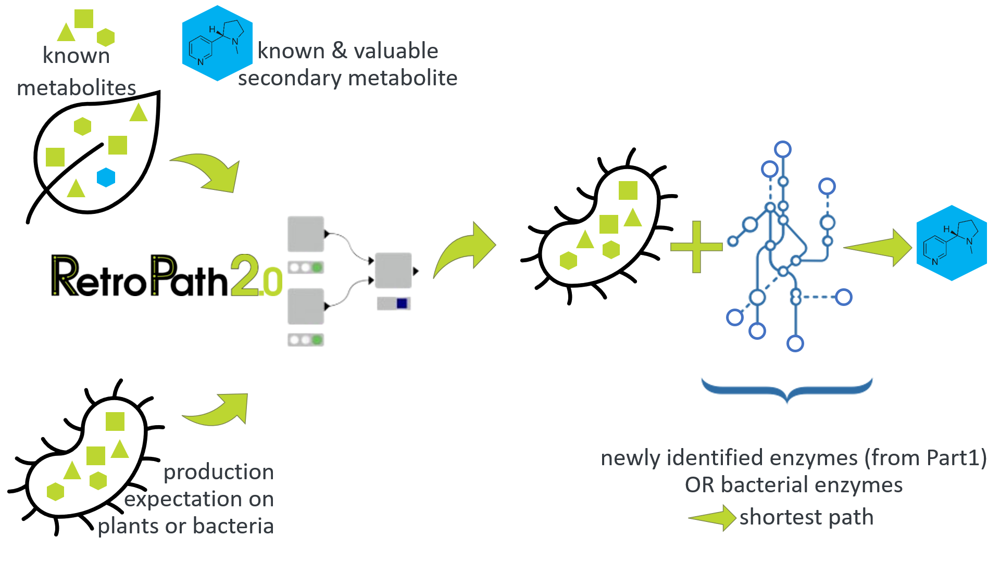

Plant secondary metabolites constitute a useful array of natural ingredients especially for therapeutics and additives for the food industry and many other industrial fields. Thereby, metabolic engineers are looking for alternative strategies that may be more efficient for the enhancement of valuable secondary metabolite production quality and quantity. However, the knowledge of production pathways and related enzymes of secondary metabolites is quite scarce. Therefore, discovery of these unknown pathway elements becomes more of an issue.

[RetroPath2.0](https://doi.org/10.1016/j.ymben.2017.12.002) is a retrosynthesis tool that can suggest possible production pathways together with their precursor and intermediate molecules and enzymes, by processing the given information of possible metabolome elements, iteratively for each step of a pathway. The goal of this project is to suggest possible biological production pathways of valuable secondary metabolites, by discovering enzymes and annotating them. This procedure serves as a promising method to uncover the unknowns of plant metabolome and propose new efficient production pathways. Thus, it has the potential to make industrial production more efficient.

